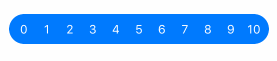
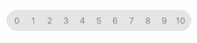

[](https://github.com/Carthage/Carthage)

# RatingSlider



Custom view for rating input. Try it out in an [example playground](Example.playground/Contents.swift) .

# Features

| :sparkles: | :mag:                                    |
| ---------- |:----------------------------------------:|
| Tap        |  |
| Pan        |  |
|`nil`       |  |

# Usage
Just initialize `RatingSlider` and add to view hierarchy as any other `UIView`. Customize it:
```swift
let slider = RatingSlider()

slider.range = 0...10
slider.font = .systemFont(ofSize: 12)

slider.activeLabelsColor = .white
slider.activeTrackColor = .blue // setting `tint` does the same

slider.inactiveLabelsColor = .gray
slider.inactiveTrackColor = .lightGray // maps to `background` property
```

# Installation
Using [Carthage](https://github.com/Carthage/Carthage#adding-frameworks-to-an-application). Add the following line to your Cartfile:
```
github "Trafi/RatingSlider"
```
